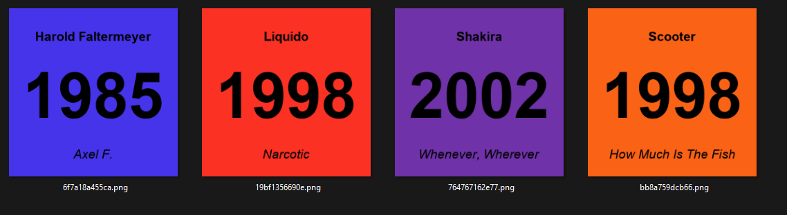

# SongCardGenerator

SongCardGenerator is a simple CLI-tool to generate cards for games like Hitster, Marimic or Play Hit based on your own music-folder.

## Demo

After generating the cards you have some picture-files like this, for example:



## Usage

```sh
git clone https://github.com/anionDev/SongCardGenerator
cd SongCardGenerator
python Generate.py -s /.../songsfolder -t ./targetfolder -r /.../arial.ttf -b /.../arialbd.ttf -i /.../ariali.ttf
```

## Remarks

- Caution: This scripts needs a clean target-folder. So any already existing file in the given targetfolder will be removed.
- This script generates only pictures-files. It does not generate any QR-code and it also does not provide any music.
- For each subfolder in the songs-folder a cards-set in targetfolder is generated. So it is required to have the music-files in a subfolder of the songs-folder.
- Only mp3-files are supported.
- The content (year, artist and songname) will be extracted from the mp3-file-metadata.
- The commandline-argument `-n` adds an increasing number to the picture and adds the same number as filename-prefix.
- You must provide font-files (for example ttf-files). There is no default- or fallback-value which could be used instead.
- The filenames of the png-files are random but will be the same for 2 files if the year, the artists and the songname is the same.

## Statistics

After a succesful generation-process you get a small statistic-diagram to see how many songs you have from which year.
Example:

```
Generate set "Test"...
Dispersion:
      1996 | ███████████████ (1)
      1997 | ███████████████ (1)
      1998 | ██████████████████████████████ (2)
      1999 | ███████████████ (1)
      2000 | ███████████████ (1)
      2001 |  (0)
      2002 | ███████████████ (1)
```
